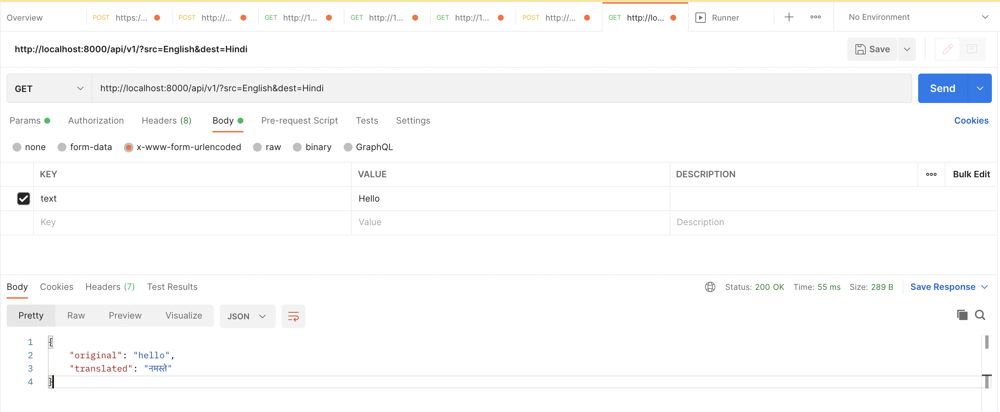
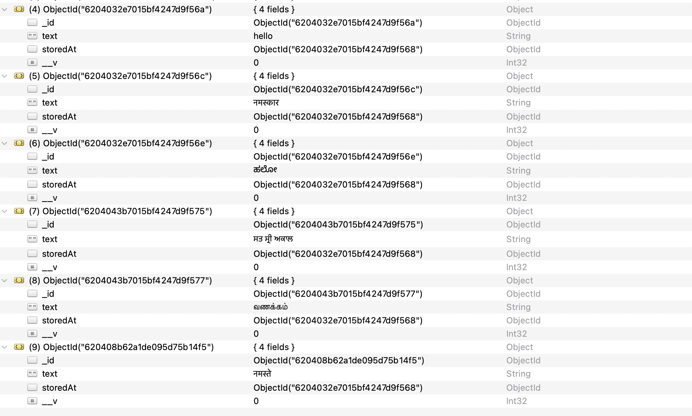
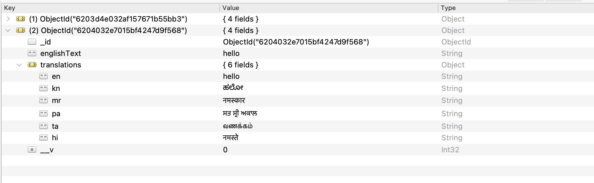

# Translation API with Cashing
- Open Api to translate text from one language to other and cash the result to get faster result
# Setup

- PreRequisit
    - NodeJs
    - MongoDB
    - Go To rapidAPI and create free key for google Translate API


- Create .env file in root of folder ans add SECRET_KEY = "< KEY >"
 or

        echo "SECRET_KEY = '<Insert KEY Here>' " > .env

- Install node packages from npm

        npm install

- Run the project

        node index.js
        

# API

- Input
    - Pass source language and target language as query Params

    - Pass Text as x-www-form-urlencoded withkey text and value as the sentence to be translated

    - [GET] http://localhost:8000/api/v1/?src=English&dest=Hindi

- Output
    - JSON object 
        ```
        {
            original: original_Text,
            translated: Translated_text
        }
        ```
- 

# Cashing Design

- created 2 Collections
    - 1st collection is key value cash where
        - [text] key is Text
        - [storedAt] value is object reference of second collection
        - 

    - 2nd collection has 2 keys
        - EnglishText
            - which is point of reference to combine translation between languages where sorce or target language is not english

        - Translations
            - HashMap, where key is ISO6391 representation of language
            - value is translation in that perticular language

        - 
- When a api is called for same Translation it checks if the source text is present in cash. If it is present it populates the storedAt. Finds in the Translations if targate language key is presunt if it is present returns the json response, else calls external API translate the text and store appropiatly in both collection


